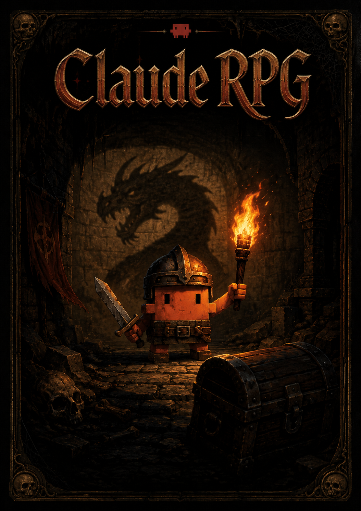

# ClaudeRPG — A Self-Building Wiki as Game Memory

A starter template for running a persistent, narrative roleplaying game with [Claude](https://claude.ai) (or any capable LLM) as the gamemaster, where the **wiki *is* the memory**. Every named NPC, location, item, faction, or rule that appears in play is written into a Markdown file the moment it shows up. Future sessions read those files lazily — only what is relevant to the current scene — and the world stays consistent without anyone keeping it all in their head.

This repository contains the empty scaffold: protocol, conventions, frontmatter schema, lint rules, and folder structure. No story content. Fork it, point Claude at the folder, and start playing.

---

## Git mode — the repository is the world

Beyond the wiki, this repo can play itself **through Git**. Git primitives are not
storage here; they are the game mechanics:

- **`main` is the canonical timeline.** History is the immutable past of the world.
- **Every player action is a Pull Request.** Opening it declares intent, CI checks are
  the laws of physics, and **merging makes it real**.
- **The GM is a CI job.** After every merge, a provider-agnostic LLM gamemaster wakes
  up in GitHub Actions, narrates the consequences, canonizes new entities, and opens
  its own world-state PR back at you. Merging the GM's PR is turning the page — and
  your review is the firewall against hallucinated canon.
- **Fate is a hash.** Dice rolls are derived deterministically from the merge commit
  SHA — provably fair, unfudgeable by player *or* GM, verifiable forever
  (`scripts/dice.py`, ledger in `meta/rolls.md`).
- **Branches are alternate timelines.** Fork reality to explore a what-if, merge it to
  make it real, or archive it and `cherry-pick` a memory out of a dead timeline. Merge
  conflicts are narrative **paradoxes** the GM resolves in fiction.
- **Issues are quests, milestones are chapters, releases are chapter recaps.**
- **Changing the world costs Weave.** A diff-cost economy meters how much reality one
  action may rewrite, enforced by CI against your character sheet.

The full rulebook is [`meta/git-protocol.md`](./meta/git-protocol.md).

### Git mode setup

1. Fork this repo.
2. Add the secret `GM_API_KEY` and repo variables `GM_PROVIDER` (`anthropic` or
   `openai`), `GM_MODEL`, and optionally `GM_BASE_URL` — the `openai` provider with a
   custom base URL covers OpenRouter, vLLM, Ollama, and any OpenAI-compatible endpoint.
3. Add a fine-grained PAT (this repo only: Contents RW, Pull requests RW, Issues RW)
   as the secret `GM_GITHUB_TOKEN`, so the GM's own PRs get validation checks.
4. Run the **setup** workflow (Actions → setup). It creates labels and the Chapter 1
   milestone, sanity-checks your configuration, and can seed a ready-to-play demo
   campaign as a `demo-campaign` branch.
5. Open a **session-zero** PR to co-author your world with the GM — or open the PR
   `demo-campaign → main`, label it `session-zero`, and merge. The GM's first turn is
   the opening scene.

Git mode is optional. Everything below — local play in Claude Code or any editor —
still works unchanged.

---

## The idea in one paragraph

LLMs forget. They have a context window, not a memory. So instead of trying to keep a campaign in the chat, **externalize the world to files**. The GM's job, alongside narrating, is to write down anything new the moment it is established — and then, before the next turn, read only the files relevant to where the player actually is. The wiki grows session by session. Old sessions don't have to be re-read; their consequences live in the canon files. The GM gets a coherent world without burning context, and the player gets a campaign that actually remembers itself.

## How it works

Three protocols do the heavy lifting:

1. **Lazy loading.** At session start the GM reads only six files: `index.md`, `meta/canon.md`, `meta/conventions.md`, `character/sheet.md`, `plot/state.md`, and the most recent file in `sessions/`. During play, the GM loads further articles only when the scene demands them — Tier-1 (index one-liner) for mentions, Tier-2 (Quick Reference block) for routine interaction, Tier-3 (full article) for deep encounters.

2. **Immediate canonization.** The instant a new entity appears in narration — a named NPC, a location, an object, a rule, a relationship — the GM writes a new article with full frontmatter and adds a one-liner to the relevant `_index.md`. Nothing is "for later." This is what makes the wiki stay in sync with the fiction.

3. **Self-improvement (lint).** After every session the GM runs a structured audit: orphaned articles, stale entries, missing articles for entities mentioned in logs, contradictions, index drift, tag chaos, Tier-2 bloat, and aging seeds. A timestamped lint report lands in `meta/`, and the GM proposes fixes to the player before applying them.

The full GM protocol lives in [`CLAUDE.md`](./CLAUDE.md). Read that file first.

## Directory structure

```
ClaudeRPG/
├── CLAUDE.md                       GM system prompt: schema and protocol
├── index.md                        Top-level navigation
├── README.md                       This file
├── LICENSE                         MIT
├── meta/
│   ├── canon.md                    Non-negotiable world rules
│   ├── conventions.md              File naming, IDs, tags, linking, indexes
│   ├── lint-protocol.md            Self-audit checks
│   ├── contradictions.md           Flagged inconsistencies (clarified, never silently overwritten)
│   └── seeds.md                    Pre-planted plot threads with triggers
├── character/
│   ├── sheet.md                    Character sheet
│   └── journal.md                  In-character first-person diary
├── plot/
│   ├── state.md                    Current state of the story (recap, mysteries, last scene, plan)
│   ├── active-quests.md            Open objectives
│   └── completed-quests.md         Resolved objectives
├── world/
│   ├── regions/_index.md           Locations
│   ├── npcs/_index.md              Non-player characters
│   ├── lore/_index.md              Myths, history, languages, cosmology
│   ├── items/_index.md             Significant objects
│   ├── factions/_index.md          Organizations
│   └── bestiary/_index.md          Creatures
└── sessions/                       Append-only narrative logs, one file per session
```

Every article (except indexes and logs) starts with YAML frontmatter:

```yaml
---
id: <category>-<slug>
title: <Display Name>
type: npc | location | item | faction | lore | creature | quest
tags: [tag1, tag2]
status: alive | dead | unknown | active | resolved
importance: major | minor | seed
first_seen: <session-id>
last_seen: <session-id>
related: [id1, id2]
summary: <one sentence — propagates to the _index>
---
```

…followed by `## Quick Reference`, `## Details`, and `## Encounters`. See `CLAUDE.md` for the full template.

## Getting started

1. **Fork or clone this repo** into a folder on your machine — for example via [Claude Code](https://www.anthropic.com/claude-code), the Claude desktop app's filesystem access, or any local editor.
2. **Open the folder with Claude.** Either point Claude Code or Cowork mode at it, or paste the contents of `CLAUDE.md` into the system prompt of a new chat alongside the contents of the relevant files.
3. **Tell Claude you want to play.** The first thing it should do is read the six startup files. With an empty repo, that means it will see the protocol but no canon yet.
4. **Define the campaign together.** Decide on genre, tone, and starting premise — record them in `meta/canon.md`. Decide on the player character's starting situation — record it in `character/sheet.md`.
5. **Begin.** Claude narrates the opening scene in second person. As soon as it names anything, it canonizes it. The wiki starts growing.

A clean way to bootstrap: ask Claude to *propose* a setting and starting premise, edit it together, then save the result into `meta/canon.md` and start session 1.

## Why this works (and why it isn't just "long context")

- **Token cost stays bounded.** A campaign with 200 entries doesn't load 200 entries per turn. It loads ~6 boot files plus whatever the current scene actually touches. Most turns: 1–3 articles.
- **Consistency comes from re-reading, not memorizing.** The model doesn't have to remember the innkeeper's name three sessions later — the file does. The model just looks it up.
- **The format is the prompt.** Frontmatter gives Claude structured handles: status, importance, related links. The lint protocol gives it a recurring self-correction loop. Together they replace a lot of prompt engineering with file engineering.
- **It's portable.** Plain Markdown. Works in [Obsidian](https://obsidian.md), VS Code, any editor. The `[[id]]` links resolve in Obsidian; in plain Markdown viewers they're at least human-readable. Nothing is locked into a tool.

## Customizing it

The scaffold is opinionated but not rigid. Common adaptations:

- **Different genre.** Edit `meta/canon.md` — that's where genre, tone, and hard rules live. The structure is genre-agnostic.
- **Dice or rules system.** Currently free-form narrative. To add mechanics, document them in `meta/canon.md` and extend `character/sheet.md` with stats, hit points, etc.
- **Multiple player characters.** Duplicate `character/` per player or rename the folder to `characters/<name>/`. Update the loading protocol in `CLAUDE.md` accordingly.
- **Different categories.** Add a folder under `world/` with its own `_index.md`, and reference it in `index.md`. The convention is small and easy to extend.

## Tips

- **Be strict about canonization in the first few sessions.** That's when bad habits form. Once the loop is automatic, it costs nothing.
- **Trust the lint pass.** It catches the things you forget — especially missing articles for entities that got mentioned in passing.
- **Keep the IC journal.** It's optional in mechanics but invaluable for tone — re-reading it before a session puts you back inside the character faster than reading the GM logs would.
- **Don't over-write.** Quick Reference is for the GM, not for you. Five to ten lines. The Details section can be longer; it's only loaded when needed.

## License

MIT — see [`LICENSE`](./LICENSE). Use, fork, modify freely. If you build something interesting on top of this, a link back is appreciated but not required.

## Origin

This template is a generalization of a personal campaign system the author has been running with Claude. The original setting and story are not included — only the structure, conventions, and protocol that make the system work.
